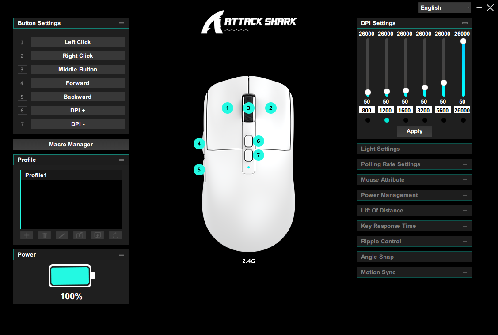

# Attack Shark X6 Custom Software Skin

A fan-made custom skin for the **Attack Shark X6** mouse software.

This project gives the original software a cleaner, more modern cyan-themed appearance while keeping all functionality unchanged. It is intended purely as a visual modification for users who prefer a different look.

## 📷 Preview

## 📝 Changelog

### Version 1.2
- Updated the skin to support the latest version of the Attack Shark X6 software.
- Fixed various icon and UI design inconsistencies.
- Changed the font to **Segoe UI** for a cleaner and more readable interface.
- Added Arabic language support.
- Reverted the close and minimize icons to the original versions because the latest software update uses smaller window control buttons.

### Version 1.1
- Organized the project files for easier navigation.
- Improved several icons for better visual consistency.
- Added an installer for easier setup.
- Added a portable version that can be run without installation (Enigma Virtual Box).

### Version 1.0
- Replaced the original **red** color scheme with a modern **cyan** theme.
- Updated the battery icon.
- Recolored the software icons.
- Updated the connection mode icons.
- Restyled the close and minimize buttons.
- Changed the background from a dark blue/cyan shade to a sleek black.
- Updated the application icon.
- Updated the Windows tray icon.
- No functionality has been modified—this is purely a visual skin.

---

> [!IMPORTANT]
> This is an **unofficial** modification.
>
> - I am **not affiliated with Attack Shark** in any way.
> - This project was created as a personal hobby project and is shared with the community for free.
> - **All rights to the original software belong to Attack Shark.** This repository only contains my modified visual assets and instructions.
